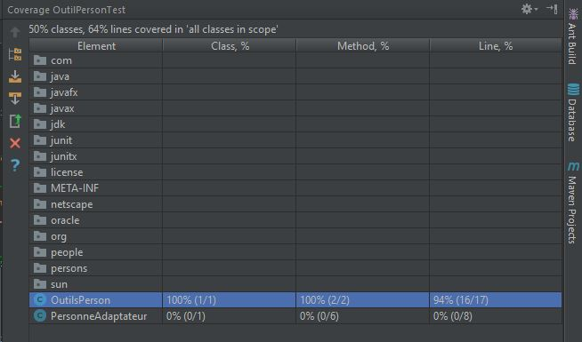

**DOLLE Jérémy**

**PETITCUENOT Mélanie**

# Rapport TP3

# Tests boite noire

## Question 1 :

Nous avons réalisé l'analyse partionnelle suivante pour chaque classe :

- **Méthode wasBorn()** :
    - Dates retournant un résultat vrai (après la date de naissance)
    - Dates retournant un resultat faux (avant la date de naissance)
    
- **Méthode getAge()** :
    - Dates retournant un résultat vrai (test avec age correct)
    - Dates retournant un resultat faux (test avec age incorrect)
    - Dates retournant une exception (mois > 12, jour > 31)

## Question 2 :

 Voici les différents tests mis en place dans la classe _PersonTest_. Tous les tests réussissent.
 
```java
    public class PersonneTest {
    
        private IPerson person;
            @Test
        public void wasBornTrueTest() {
            assertTrue(person.wasBorn(new GregorianCalendar(1995, 3, 17)));      // Exact Date
            assertTrue(person.wasBorn(new GregorianCalendar(2016, 2, 29)));      // After Date + Bisextil
            assertTrue(person.wasBorn(new GregorianCalendar(2017, 12, 10)));     // GregorianCalendar month +1
        }
    
        @Test
        public void wasBornFalseTest()
        {
            assertFalse(person.wasBorn(new GregorianCalendar(1993, 5, 28)));     // Before Date
        }
    
        @Test
        public void getAgeTrueTest(){
            assertTrue(person.getAge(new GregorianCalendar(2017,3,29)) == 22);     
            assertTrue(person.getAge(new GregorianCalendar(1995,3,17)) == 0);
        }
    
        @Test
        public void getAgeFalseTest(){
            assertFalse(person.getAge(new GregorianCalendar(2017,3,29)) == 12);
            assertFalse(person.getAge(new GregorianCalendar(2017,3,29)) == 100);
        }
    
        @Test(expected = IllegalArgumentException.class)
        public void getAgeExceptionTest(){
            assertThat(person.getAge(new GregorianCalendar(1955,3,17)) == 0);
        }
    }
```

## Question 3 :


Pour ce faire, il suffit de créer une classe mère qui contiendra les méthodes de test. On y ajoute une methode qui s'execute avant les méthodes de test grâce au mot clé @before. 
Cette méthode va initialiser le type de personne. Ainsi, pour un type de personne on va créer une classe associée qui extends la classe mère et qui override la methode setUp(). 

```java
    public class PoeplePersonneTest extends PersonneTest{
        @Override
        public void setUp() {
            PersonneAdaptateur personneAdaptateur = new PersonneAdaptateur("PETITCUENOT","Melanie",17,3,1995);
            super.setPerson(personneAdaptateur);
        }
    }
```

## Question 4 :

_**Simple personne**_ :
 - getAgeException => exception non gérée dans le code

_**EfficientePersonTest**_ :
 - getAgeException => exception non gérée dans le code
 - wasBornFalseTest => compare l'age et ne tient pas compte de la date renseignée
 - getAgeTrueTest  => retourn l'age de la personne et ne tient pas compte de la date de référence à laquelle on souhaite connaitre l'age

_**YetAnotherPerson**_ :
 - pas d'erreur : test à revoir
 
_**OneMorePersonn**_ : 
 - getAgeTruTest => Exeption sur le jour même

_**SmallCodePersonTest**_ :
 - erreur sur le test getAgeTrueTest
 
## Question 5 :

Nous avons choisi d'utiliser le patron _***adaptateur***_ qui va nous permettre d'adapter la classe People en implementant l'interface IPerson. 

```java 
    public class PersonneAdaptateur implements IPerson {
    
        private Personne personne;
    
        public Personne getPersonne() {
            return personne;
        }
    
        public PersonneAdaptateur(String name, String lastname, int month, int day, int year) {
            this.personne = new Personne(lastname,name,day,month,year);
        }
    
        public String getName() {
            return getPersonne().getName();
        }
    
        public String getFirstName() {
            return getPersonne().getFirstName();
        }
    
        public boolean wasBorn(GregorianCalendar gregorianCalendar) {
            return getAge(gregorianCalendar) >= 0;
        }
    
        public int getAge(GregorianCalendar gregorianCalendar) {
            return getPersonne().getAge(gregorianCalendar);
        }
    }

```
Ainsi, nous allons pouvoir lui faire passer les classes de test faites précedemment. Il suffira de faire passer l'adaptateur dans la methodes qui initialise la personne.

```java
    public class PoeplePersonneTest extends PersonneTest{
    
        @Override
        public void setUp() {
            PersonneAdaptateur personneAdaptateur = new PersonneAdaptateur("PETITCUENOT","Melanie",17,3,1995);
            super.setPerson(personneAdaptateur);
        }
    }  
```

# Tests en isolation et Mock

## Question 6 :

Voici la méthode de la classe _OutilPerson_ que nous avons implémentée.

```java
    public class OutilsPerson {
        static List<IPerson> personBetween(List<IPerson> persons, GregorianCalendar gregorianCalendar, int ageMin, int ageMax)
            {
                List<IPerson> includedPersons = new ArrayList<IPerson>();
                if (ageMin>ageMax)
                    throw new IllegalArgumentException("Illegal");
                for(IPerson person : persons)
                {
                    if(person.getAge(gregorianCalendar) > ageMin && person.getAge(gregorianCalendar) < ageMax)
                        includedPersons.add(person);
                }
                return includedPersons;
            }
    }
```

## Question 7 :

Voici la méthode de la classe _OutilPerson_ que nous avons implémentée.

```java
    static int recherche(List<IPerson> persons, GregorianCalendar gregorianCalendar){
        int maxAge = 0;
        if(persons.isEmpty())
            return -1;
        for (IPerson person : persons)
        {
            if(person.getAge(gregorianCalendar)>maxAge)
                maxAge = person.getAge(gregorianCalendar);
        }
        return maxAge;
    }
```

## Question 8 :

La première methode de la classe est précédée du mot clé _@before_. Cette méthode initialise entre autre les Mocks.  

```java
       public class OutilPersonTest {
       
           private List<IPerson> persons;
           private GregorianCalendar gregorianCalendar;
           
           @Before
           public void setUp() {
               persons = new ArrayList<IPerson>();
               gregorianCalendar = new GregorianCalendar(2017,4,5);
               persons.add(generateMock(22,"jeremy","dolle"));
               persons.add(generateMock(40,"mel","petit"));
           }
        
           @Test
           public void personBetweenTest() {
               assertThat(OutilsPerson.personBetween(persons,gregorianCalendar,30,45)).containsExactly(persons.get(1));
           }
        
           @Test(expected = IllegalArgumentException.class)
           public void personBetweenExceptionTest(){
               assertThat(OutilsPerson.personBetween(new ArrayList<IPerson>(),gregorianCalendar,50,20));
           }
        
           @Test
           public void rechercheTest(){
               assertThat(OutilsPerson.recherche(persons,gregorianCalendar)).isEqualTo(40);
           }
        
           @Test
           public void rechercheEmptyListTest(){
               assertThat(OutilsPerson.recherche(new ArrayList<IPerson>(),gregorianCalendar)).isEqualTo(-1);
           }
        
           private IPerson generateMock(int age, String name, String lastName){
               IPerson person = Mockito.mock(IPerson.class);
               Mockito.when(person.getAge((GregorianCalendar) anyObject())).thenReturn(age);
               Mockito.when(person.getFirstName()).thenReturn(name);
               Mockito.when(person.getName()).thenReturn(lastName);
               return person;
           }
       }
```

## Question 9 :

Pour faire ceci, il suffit d'utiliser le code Coverage disponible dans l'IDE IntelliJ. Pour la classe _OutilPersonnTest_,
on obtient le résultat suivant : 



## Question 10 :

Il suffit de creer un nouveau test en verifiant que les methodes _getFirstName()_ et _getName()_ ne sont jamais appellées grace à la méthodes _never()_ de Mockito :

```java
    @Test
    public void AnonymousTest()
    {
        for (int i = 0; i < persons.size() ; i++) {
            verify(persons.get(i),never()).getFirstName();
            verify(persons.get(i),never()).getName();
        }
    }
```
